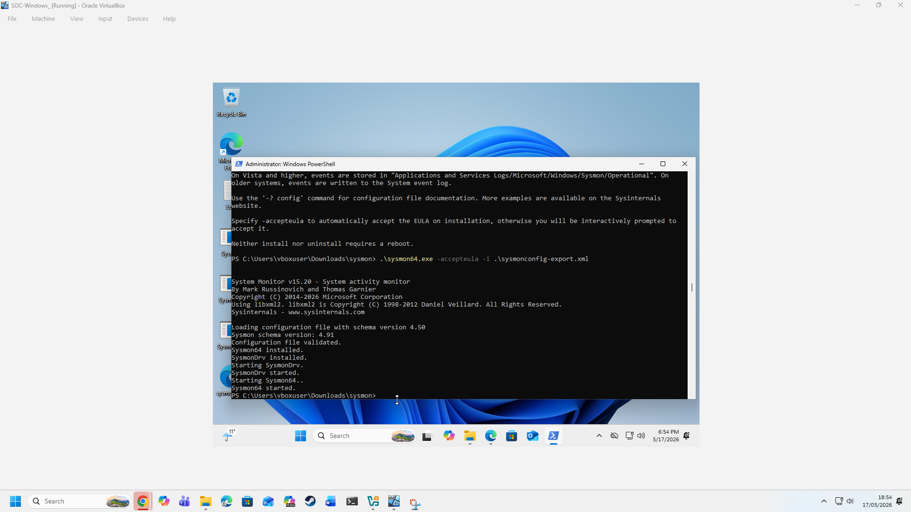
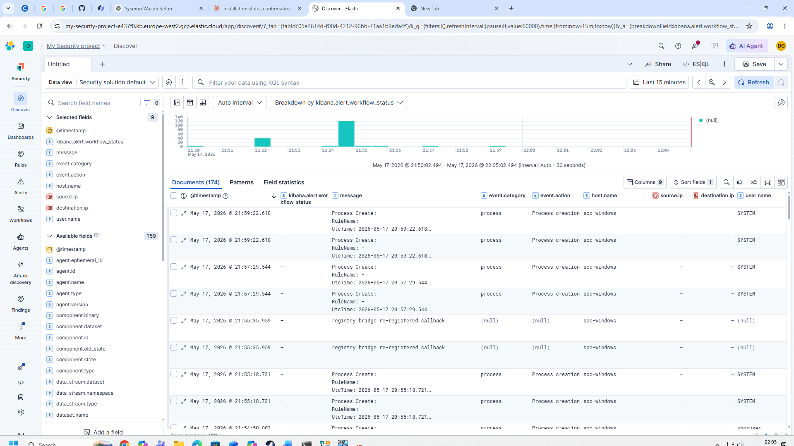
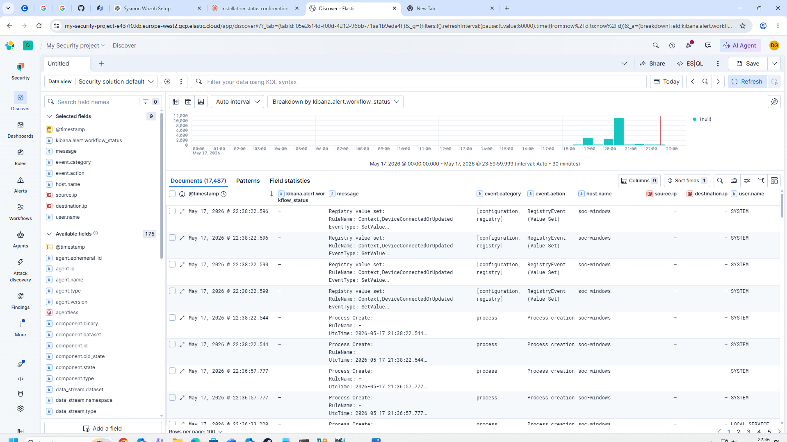
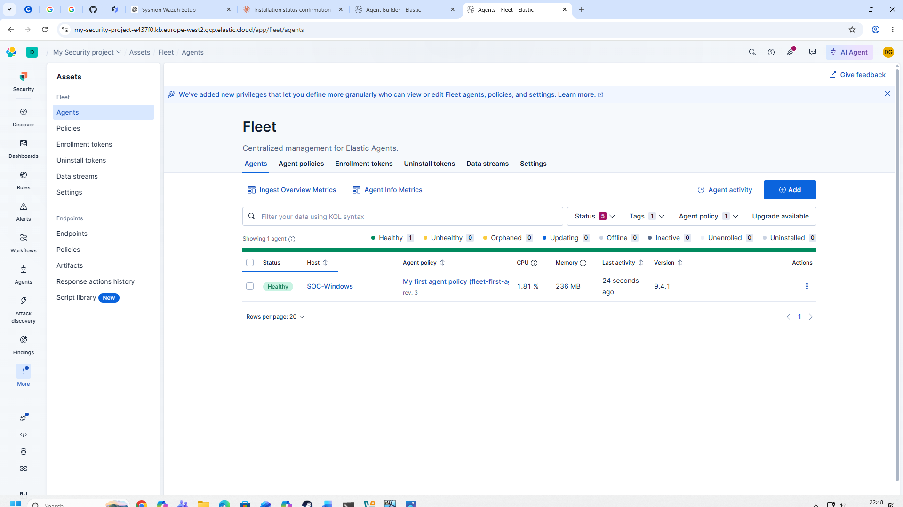
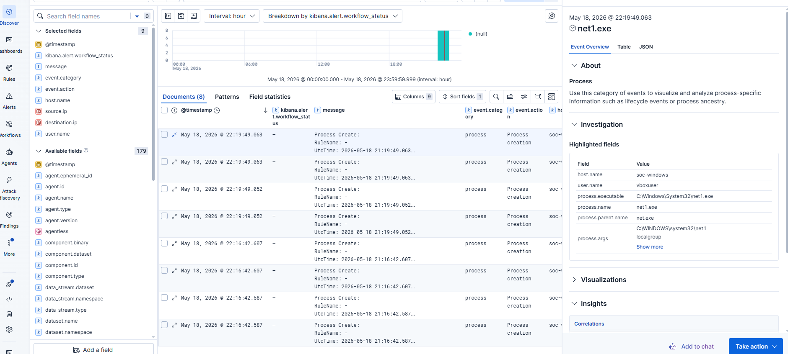

# SIEM Monitoring & Threat Detection Lab
# SIEM Monitoring & Threat Detection Lab

## Overview

I built a home cybersecurity lab to gain practical experience with SIEM monitoring, endpoint telemetry and security event investigation.

I created a Windows virtual machine using VirtualBox and installed Sysmon to generate detailed Windows system logs. I then connected the virtual machine to Elastic Cloud using Elastic Agent, allowing me to collect and investigate endpoint events through Kibana.

The project helped me understand how security analysts use endpoint telemetry to investigate system activity.

## Technologies Used

- VirtualBox
- Windows
- Sysmon
- Elastic Cloud
- Elastic Agent
- Kibana

## Lab Setup

The lab consisted of a Windows virtual machine running inside VirtualBox. Sysmon was installed on the Windows system to record detailed activity such as process creation and registry events.

Elastic Agent was then connected to Elastic Cloud so that endpoint telemetry from the virtual machine could be viewed and analysed in Kibana.

## Investigation

Using Kibana Discover, I reviewed events generated by the Windows endpoint and filtered the collected telemetry to investigate specific activity.

For example, I investigated a `net1.exe` process creation event and reviewed fields including:

- Host name
- User name
- Process name
- Process executable
- Parent process
- Process arguments

This allowed me to see how individual Windows processes can be identified and investigated using SIEM data.

## Evidence

### 1. Sysmon Installation

Sysmon was successfully installed and started on the Windows virtual machine.

### 2. Process Events in Kibana

Process creation events collected from the Windows endpoint and displayed in Kibana Discover.

### 3. Event Monitoring

Kibana was used to review collected endpoint events including process and registry activity.

### 4. Elastic Agent Connection

The Windows endpoint appeared as healthy in Elastic Fleet, confirming that Elastic Agent was successfully connected.

### 5. Process Investigation

I investigated a `net1.exe` process event and examined information such as the executable path, parent process, user and process arguments.

## What I Learned

Through this project I developed practical experience with:

- Setting up a Windows cybersecurity lab
- Installing and configuring Sysmon
- Connecting an endpoint to a SIEM platform
- Collecting Windows endpoint telemetry
- Navigating Kibana Discover
- Filtering and reviewing security events
- Investigating process creation activity
- Interpreting fields such as process names, executable paths, users and parent processes

## Future Improvements

I plan to continue developing the lab by creating detection rules and investigating additional types of Windows security events.
